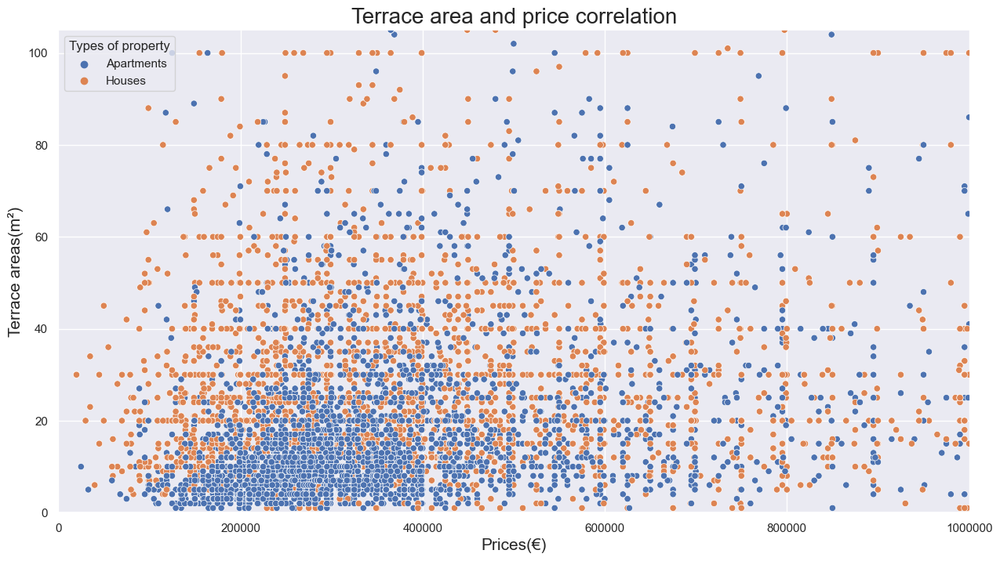
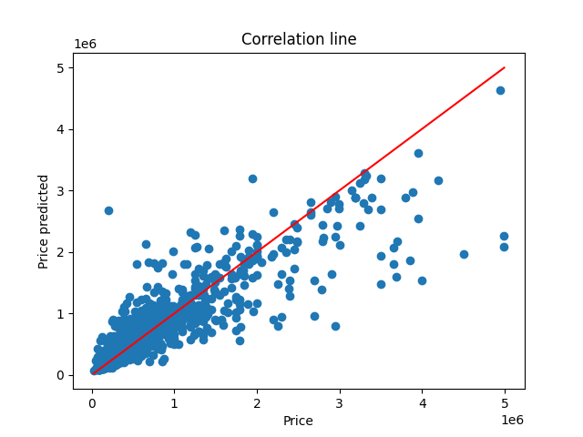

# real-estate-price-prediction

A dataset gathering information about properties all around Belgium

## Description

First several links of url page that contains all informations of a properties in sale/in rent are collected
Second all these pages are scrapped then all the datas are ordered, cleaned and saved to a scv file
Third these datas are use to diplay graphs that shows different informations
Forth the datas are normalize and different models are used to evaluate them

### Links acquisition
main.py in list_acquisition folder.

Using Selenium to open the welkom page and manage the cookie.  
Fill in the form with the name of all Belgium provinces and scrap the results of sales, for a detemined amount of pages.  
store the results in the list_of_results.txt file.  
Tested with 90 pages of results per query and collected 26k links in about 12 min.  
  
The list_of_results.txt file is used by scrapping.py in data_acquisition folder, to gather all the data from indivual properties.

### Data acquisition
main.py in data_aquisition folder.

Take a file full of URL's from Immoweb.
Verify the URL's and find their language.
Scrap the url page from the immoweb site with selenium. 
Choose only the useful datas and cleaned the useless ones.
Return a dictionnary of the property's data and save it to a scv file.

### Data analysis
main.py in data_analysis.

Use pandas to get all the datas from a scv file.
Create multiple graphs to answer some questions about the dataframe.
Save those graphs in the "graphs" folder.

  
  

### Model training
main.py in model_training

Normalize and clean the dataset to send them for different model.
Theses models return a score and save a PNG graph to show the Linear Regression line :

* Random Forest Regressor :
 
Max score : 74.34%

* Gradient Boosting Regressor :
 
Max score : 82.98


## Help

Any advise for common problems or issues.
```
command to run if program contains helper info
```

## Authors

Contributors names and contact info

* Marlies
* Pyre Arthur
* Meulemans Philippe

## Timeline

* links_acquisition / data_acquistion => 2 january 2023 to 6 january 2023
* data_analysis => 9 january 2023 to 17 january 2023
* model_training => 18 january 2023 to 26 january 2023


